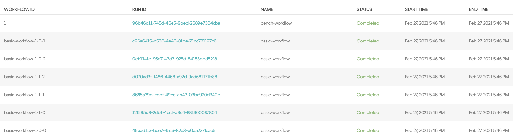
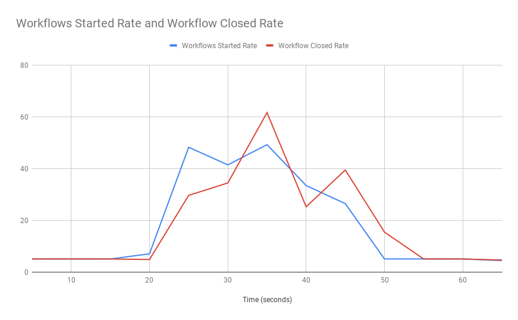

# Maru - Temporal Load Simulator

Tool to generate load for [Temporal](https://github.com/temporalio/temporal/) workflows. Named after [Kobayashi Maru](https://en.m.wikipedia.org/wiki/Kobayashi_Maru).

**⚠️ WARNING**

This repository is a load generator for Temporal and does not represent suggested Go SDK practices or worker settings.
Please reference the Go SDK documentation, or the Go SDK samples for better guidance.

## How It Works

This repository defines a Temporal workflow which serves as a driver for load tests. Given the definition
of a target load profile, the [`bench`](https://github.com/temporalio/maru/tree/master/worker/bench)
workflow would drive the target load and collect the workflow execution statistics.

## Run the Bench Locally

The driver application reads the following environment variables to connect to a Temporal Server:

```
NAMESPACE=default
FRONTEND_ADDRESS=127.0.0.1:7233
PROMETHEUS_URL=http://prometheus-server
```

You will need to run the bench application, which also acts as a Temporal worker. Use the makefile to do so:

```bash
cd worker
make run
```

## Deploy the Bench

The Bench workflow can be deployed to your target Temporal cluster, next to the workflows-to-be-benchmarked.
You can choose to benchmark your own workflows or use the included [`basic`](https://github.com/temporalio/maru/tree/master/worker/target/basic)
workflow for starters.

The provided [Helm chart](https://github.com/temporalio/maru/tree/master/helm-chart) can help you deploy
the Bench application to your existing Kubernetes cluster.

## Start a basic test using an input file

Once the bench worker and target workflows are running, you can start a quick test with the following command

* Note: make sure you run this command in the base directory of your cloned maru repository (not the worker directory where you started the worker earlier).

```
tctl wf start --tq temporal-bench --wt bench-workflow --wtt 5 --et 1800 --if ./scenarios/basic-test.json --wid 1
```

This command starts a basic Bench workflow which in turns runs the Basic workflow six times. If everything is configured correctly, you should be able to see those workflows in Web UI:



## Inspect the Bench Result

The Bench workflow returns the statistics of the workflow execution. You can query the workflow to retrieve execution statistics with the following command

```
$ tctl wf query --qt histogram --wid 1
Query result:
[[{"started":6,"closed":6,"backlog":0}]]
```

The workflow completed almost instantaneously, so there is just one data point. Let's try a more sophisticated scenario.

## Start a longer load test using an input file

Here is a sample test that runs a steady workload of 20 workflows per second for 10 minutes:

```
tctl wf start --tq temporal-bench --wt bench-workflow --wtt 5 --et 1800 --if ./scenarios/basic-const12k.json --wid 2
```

It runs 12,000 workflows in total. The scenario also sets the reporting interval to 10 seconds, which means that the resulting report will have data points for every 10-second interval.

## Retrieve the statistics of processing

Execute the `histogram` query to retrieve the execution statistics

```
$ tctl wf query --qt histogram --wid 2
Query result:
[[{"started":200,"closed":200,"backlog":0},{"started":200,"closed":200,"backlog":0},
{"started":200,"closed":200,"backlog":0},{"started":200,"closed":200,"backlog":0},
{"started":200,"closed":200,"backlog":0},{"started":200...
```

The result is a JSON array of execution statistics, where each array item represents a single time interval.

You can also retrieve the same information printed as a CSV file with the `histrogram_csv` query

```
$ tctl wf query --qt histogram_csv --wid 2
Query result:
[Time (seconds);Workflows Started;Workflows Started Rate;Workflow Closed;Workflow Closed Rate;Backlog
10;200;20.000000;200;20.000000;0
20;200;20.000000;200;20.000000;0
30;200;20.000000;200;20.000000;0
40;200;20.000000;200;20.000000;0
50;200;20.000000;200;20.000000;0
...
```

You can convert the workflow result to a chart using charting software of your choice.
For example, save the CSV to a file, upload it to from Google Spreadsheets, and build a chart from columns 1, 3, 5, and 6:


## Retrieve the metrics

If you have Prometheus installed and configured, you can pass its URL via `PROMETHEUS_URL` environment variable (default: `http://prometheus-server`),
you can use an additional query to retrieve the metrics of storage and History service utilization:

```
tctl wf query --qt metrics_csv --wid 2
Query result:
[Time (seconds);Persistence Latency (ms);History Service Latency (ms);Persistence CPU (mcores);History Service CPU (mcores);History Service Memory Working Set (MB)
60;8;456;494;418;27
120;9;479;1733;970;72
180;9;481;2537;996;80
240;9;481;3623;978;85
300;9;482;3652;949;87
360;9;477;3462;973;92
420;9;470;2522;636;91]
```

## Variable load

You can define a load profile consisting of multiple steps. For example, you can start and finish the test with low number of executions per second but have a spike of high load in the middle.



The above chart shows statistics from a sample run of `./scenarios/basic-spike.json`.

## Configure your own scenario

You can tweak the parameters of the benchmark scenario by adjusting the JSON file. Let's take the `basic-const12k.json` scenario as a starting point:

```json
{
    "steps": [{
        "count": 12000,
        "ratePerSecond": 20,
        "concurrency": 5
    }],
    "workflow": {
        "name": "basic-workflow",
        "taskQueue": "temporal-basic",
        "args": {
            "sequenceCount": 3,
            "parallelCount": 1
        }
    },
    "report": {
        "intervalInSeconds": 10
    }
}
```

Here are all the parameters you may configure:

- `steps` - An array that defines one or more steps of the load test.
- `steps[i].count` - The total number of target worflow executions for a bench run.
- `steps[i].ratePerSecond` - The maximum number of workflow executions to start per second (rate limiting). By default, no rate limiting applies.
- `steps[i].concurrency` - The number of parallel activities that bench will use to start target workflows. Can be useful when `ratePerSecond` is too high for a single activity to keep up. Defaults to `ratePerSecond` divided by `10`.
- `workflow.name` - The name of a workflow to be used as the testing target. The bench will start `step[*].count` of these workflows.
- `workflow.taskQueue` - The name of the task queue to use when starting the target workflow.
- `workflow.args` - Arguments to send to the target workflows. This must match the shape of the target workflow's inputs.
- `report.intervalInSeconds` - The resolution of execution statistics in the resulting report. Defaults to 1 minute.

## Random inputs and outputs for the target workflow

The size of input and output data of workflows and activities may influence the performance characteristics.

The benchmark comes with a simple way to generate random payloads for your target workflows.
Here is the definition of the workflow in `./scenarios/basic-payload.json`:

```json
"workflow": {
    "name": "basic-workflow",
    "taskQueue": "temporal-basic",
    "args": {
        "sequenceCount": 3,
        "payload": "$RANDOM(100)",
        "resultPayload": "$RANDOM_NORM(80,10)"
    }
}
```

Note how the `args` parameter contains two fields with "formulas" in them:

- `$RANDOM(<length>)` generates a random string of the given length.
- `$RANDOM_NORM(<mean>,<stdvar>)` generates a random string of a random length from the given normal distribution.

The formulas are replaced with random values by the benchmark workflow, so each target workflow execution receives its own value.
