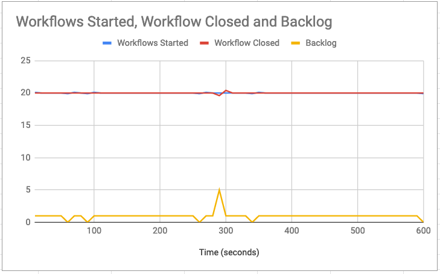

# Temporal Bench

Benchmarking tool for [Temporal](https://github.com/temporalio/temporal/) workflows.

## How It Works

This repository defines a Temporal workflow which serves as a driver for benchmarking tests. Given the definition
of a target load profile, the [`bench`](https://github.com/mikhailshilkov/temporal-bench/tree/master/workflows/bench)
workflow would drive the target load and collect the workflow execution statistics.

## Run the Bench Locally

The driver application reads the following environment variables to connect to a Temporal Server:

```
NAMESPACE=default
FRONTEND_ADDRESS=127.0.0.1:7233
```

You will need to run the bench application, which also acts as a Temporal worker. Use the makefile to do so:

```bash
make run
```

## Deploy the Bench

The Bench workflow can be deployed to your target Temporal cluster, next to the workflows-to-be-benchmarked.
You can choose to benchmark your own workflows or use the included [`basic`](https://github.com/mikhailshilkov/temporal-bench/tree/master/workflows/bench)
workflow for starters.

The provided [Helm chart](https://github.com/mikhailshilkov/temporal-bench/tree/master/helm-chart) can help you deploy
the Bench application to your existing Kubernetes cluster.

The provided [Pulumi program](https://github.com/mikhailshilkov/temporal-bench/tree/master/pulumi) shows an example
of deploying a new Azure Kubernetes Cluster, the Temporal server, and the bench from scratch. This way, you can
easily experiment with running different sizes of Kubernetes clusters.

## Start a basic test using an input file

Once the bench worker and target workflows are running, you can start a quick test with the following command

```
tctl wf start --tq temporal-bench --wt bench-workflow --wtt 5 --et 1800 --if ./scenarios/basic-smoketest.json --wid 1
```

This command starts a basic Bench workflow which in turns runs the Basic workflow six times. If everything is configured correctly, you should be able to see those workflows in Web UI:


## Inspect the Bench Result

The Bench workflow returns the statistics of the workflow execution. Retrieve the result of the `bench-workflow` with the following command

```
tctl wf show --wid 1
```

The last event in the list has the type `WorkflowExecutionCompleted` and contains the output data block

```
[
  "{Histogram:{Json:[{Started:6,Closed:6,Backlog:0}],Csv:Time (seconds);Workflows Started;Workflows Started Rate;Workflow Closed;Workflow Closed Rate;Backlog\\n60;6;0.100000;6;0.100000;0}}"
]
```

## Start a longer load test using an input file

Here is a sample test that runs a steady workload of 20 workflows per second for 10 minutes:

```
tctl wf start --tq temporal-bench --wt bench-workflow --wtt 5 --et 1800 --if ./scenarios/basic-10minutes.json --wid 2
```

It runs 12,000 workflows in total. The scenario also sets the reporting interval to 10 seconds, which means that the resulting report will have data points for every 10-second interval.

You can convert the workflow result to a chart like the one below using charting software of your choice (this one if from Google Spreadsheets):



## Configure your own scenario

You can tweak the parameters of the benchmark scenario by adjusting the JSON file. Let's take the `basic-10minutes.json` scenario as a starting point:

```json
{
    "scenario": {
        "count": 12000,
        "ratePerSecond": 20,
        "concurrency": 5
    },
    "workflow": {
        "name": "basic-workflow",
        "args": {
            "sequenceCount": 3
        }
    },
    "report": {
        "intervalInSeconds": 10
    }
}
```

Here are all the parameters you may configure:

- `scenario.count` - The total number of target worflow executions for a bench run.
- `scenario.ratePerSecond` - The maximum number of workflow executions to start per second (rate limiting). By default, no rate limiting applies.
- `scenario.concurrency` - The number of parallel activities that bench will use to start target workflows. Can be useful when `ratePerSecond` is too high for a single activity to keep up. Defaults to `1`.
- `workflow.name` - The name of a workflow to be used as the testing target. The bench will start `scenario.count` of these workflows.
- `workflow.args` - Arguments to send to the target workflows. This must match the shape of the target workflow's inputs.
- `report.intervalInSeconds` - The resolution of execution statistics in the resulting report. Defaults to 1 minute.
